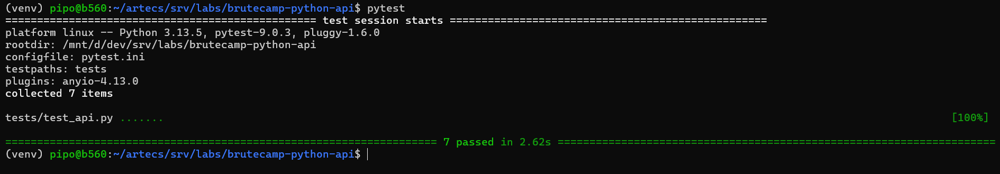
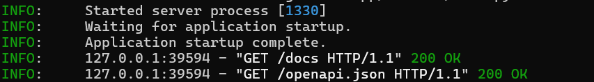
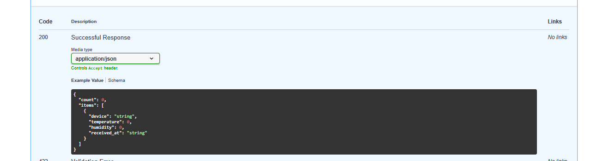

# Python-API

FastAPI-based IoT telemetry API with JWT authentication, device ingestion endpoints, testing and Raspberry Pi integration.

---

# Features

- FastAPI backend
- Modular routers
- JWT authentication
- API Key protection for IoT devices
- Pydantic validation
- Environment-based settings
- Pytest test suite
- Simulated Raspberry Pi Pico client
- Swagger/OpenAPI docs
- Structured project layout

---

# Tech Stack

- Python 3.13
- FastAPI
- Pytest
- Pydantic
- python-jose
- Uvicorn

---

# Project Structure

```text
app/
├── routers/
│   ├── auth.py
│   └── iot.py
├── settings.py
└── main.py

clients/
└── fake_pico.py

tests/
└── test_api.py
```

---

# API Endpoints

## Health Check

```http
GET /health
```

## Login (JWT)

```http
POST /api/auth/login
```

## Send IoT Metrics

```http
POST /api/iot/metrics
```

## Get Metrics

```http
GET /api/iot/metrics
```

---

# Run API

```bash
set -a
source .env
set +a

uvicorn app.main:app --reload
```

---

# Run Tests

```bash
set -a
source .env
set +a

pytest
```

---

# Swagger Docs

```text
http://localhost:8000/docs
```

---

# ScreenShots:

<p align="center">
  
  
  
</p>


# Future Improvements

- PostgreSQL persistence
- Real Raspberry Pi Pico integration
- Docker support
- CI/CD pipeline
- Grafana dashboards
